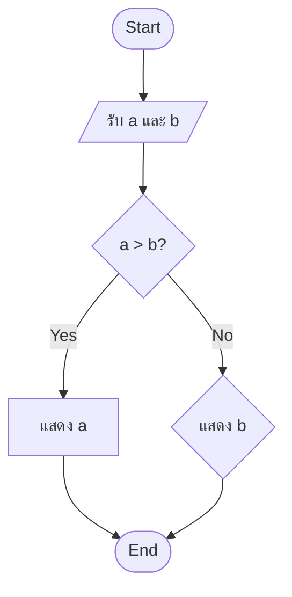
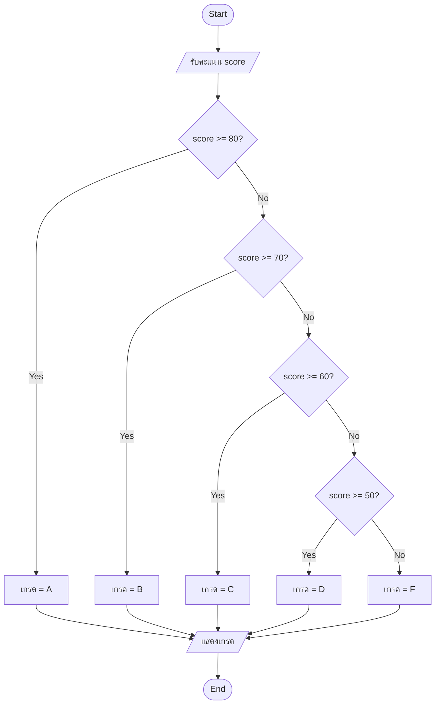
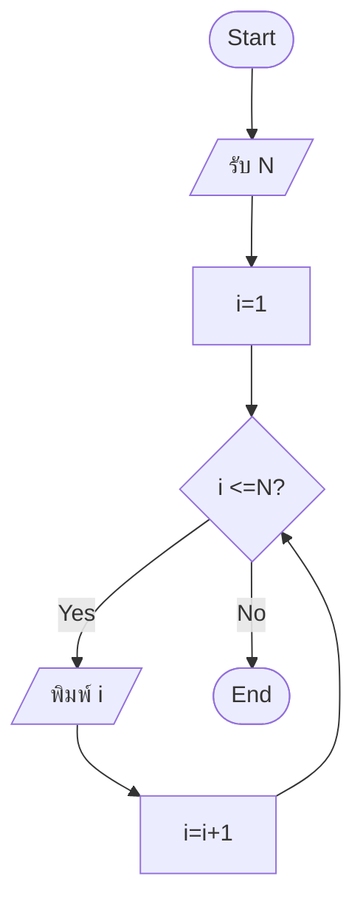

```mermaid
flowchart TD
 Start([Start]) --> Input[/รับ a และ b/]
 Input --> D1{a > b?}
 D1 -->|Yes| A[แสดง a]
 D1 -->|No| B{แสดง b}

 A & B --> End([End])
```

```mermaid
flowchart TD
Start([Start]) --> Input[/รับคะแนน score/]
Input --> b1{score >= 80?}
b1 --> |Yes| A[เกรด = A]
b1 --> |No| b2{score >= 70?}
b2 --> |Yes| B[เกรด = B]
b2 --> |No| b3{score >= 60?}
b3 --> |Yes| C[เกรด = C]
b3 --> |No| b4{score >= 50?}
b4 --> |Yes| D[เกรด = D]
b4 --> |No| F[เกรด = F]
A & B & C & D & F --> Output[/แสดงเกรด/]
Output --> End([End])
```

```mermaid
flowchart
Start([Start]) --> Input[/รับ N/]
Input --> R1[i=1] --> R2{i <=N?}
R2 --> |Yes| R3[/พิมพ์ i/]
R2 --> |No| Output([End])
R3 --> R4[i=i+1]
R4 --> R2
```
