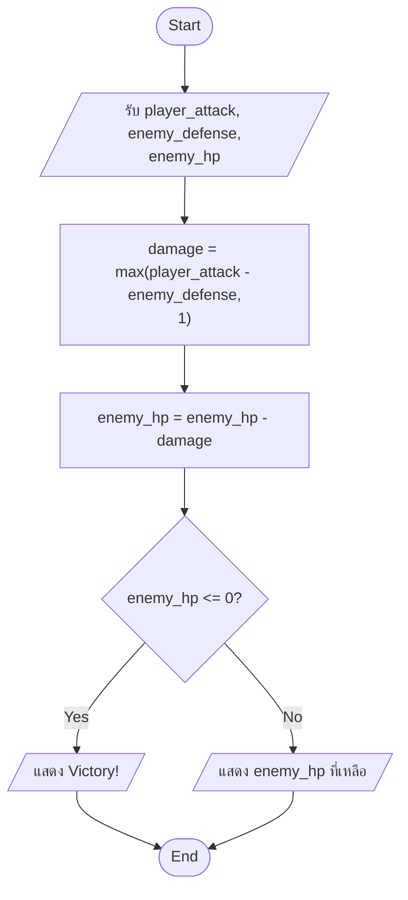
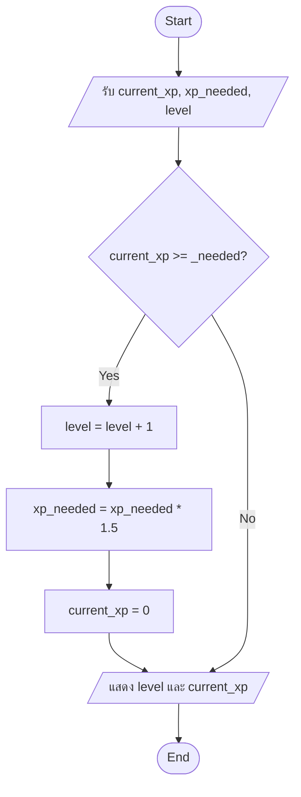

```mermaid
flowchart TD
 Start([Start]) --> Input[/รับ player_attack, enemy_defense,
enemy_hp/]
 Input --> Calc["damage = max(player_attack - enemy_defense,
1)"]
 Calc --> Reduce["enemy_hp = enemy_hp - damage"]
 Reduce --> D1{enemy_hp <= 0?}
 D1 -->|Yes| Win[/แสดง Victory!/]
 D1 -->|No| Show[/แสดง enemy_hp ที่เหลือ/]
 Win & Show --> End([End])
```

```mermaid
flowchart TD
Start([Start]) --> Input[/รับ current_xp, xp_needed, level/]
Input --> Calc{"current_xp >= _needed?"}
Calc --> |Yes| UP[level = level + 1 ]
UP --> UP1[xp_needed = xp_needed * 1.5]
UP1 --> UP2[current_xp = 0 ]
UP2 --> UP3[/แสดง level และ current_xp/]
Calc --> |No| UP3
UP3 --> End([End])
```
